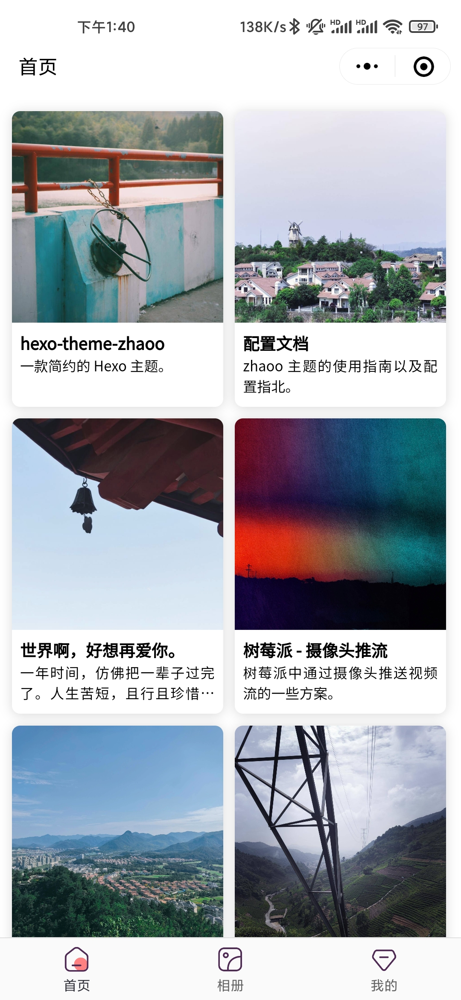
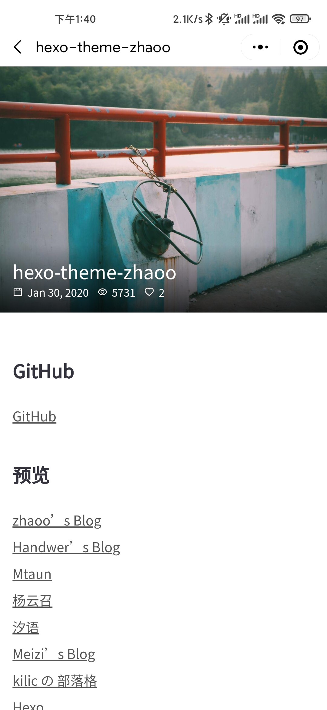
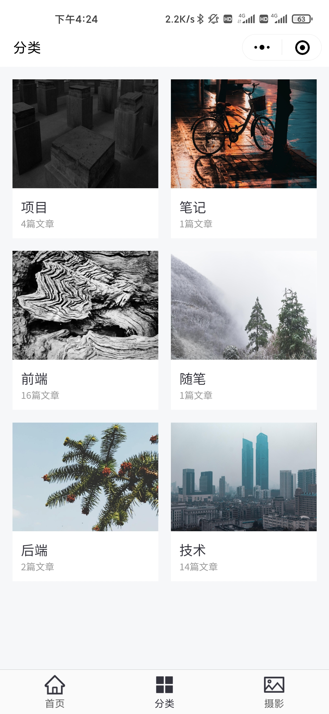
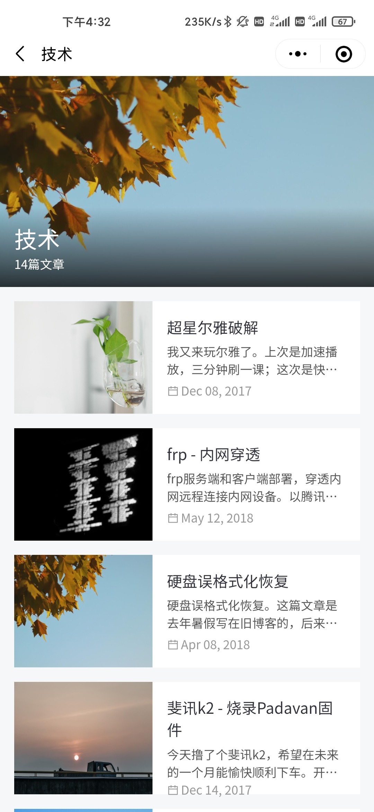
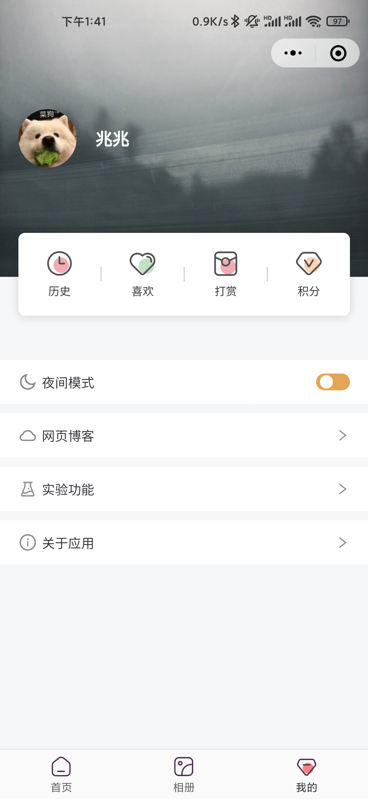
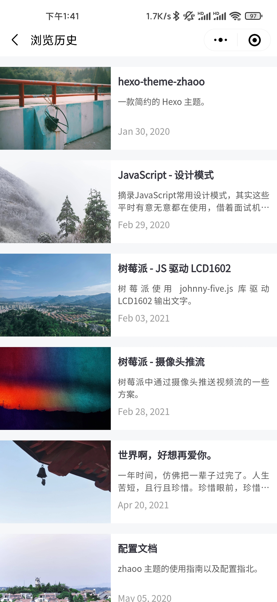

<div align="center">
  <a href="https://github.com/izhaoo/hexo-theme-zhaoo/" target="_blank" rel="noopener noreferrer">
    
  </a>
</div>

<h3 align="center">为 Hexo 定制的博客小程序</h3>  

<div align="center">
  <a href="https://github.com/izhaoo/hexo-theme-zhaoo/releases" target="_blank" rel="noopener noreferrer">
    
  </a>
  <a href="https://taro.aotu.io/" target="_blank" rel="noopener noreferrer">
    
  </a>
    <a href="https://reactjs.org/" target="_blank" rel="noopener noreferrer">
    
  </a>
  <a href="https://nodejs.org" target="_blank" rel="noopener noreferrer">
    
  </a>
  <a href="(https://github.com/izhaoo/hexo-theme-zhaoo/blob/master/LICENSE" target="_blank" rel="noopener noreferrer">
    
  </a>
</div>

## 预览

<div align="center">
  
  
</div>

## 截图

<div align="center">
  
  
</div>

<div align="center">
  
  
</div>

<div align="center">
  
  
</div>

## 部署

### RESTful

需要配合 [hexo-generator-restful](https://github.com/izhaoo/hexo-generator-restful) 插件使用，参考插件文档部署并生成 `RESTful` 接口。

修改 `/config/index.ts` 文件内的 `BASE_URL` (RESTful API) 地址字段。

### Build

注册微信小程序，修改 `/project.config.json` 文件中的 `appid` 等字段，匹配小程序配置。

```bash
yarn  // 安装依赖

// 修改 config.ts 中的配置

yarn build  // 打包
```

使用微信开发者工具打开 `dist` 目录，上传代码完成发布。

## 相关

* 主题：[hexo-theme-zhaoo](https://github.com/izhaoo/hexo-theme-zhaoo) (一款简约的 Hexo 主题)
* 插件：[hexo-generator-restful](https://github.com/izhaoo/hexo-generator-restful) (Hexo RESTful 接口)

## 协议

[MIT](https://github.com/izhaoo/hexo-theme-zhaoo/blob/master/LICENSE) License


## 注意

本仓库是我个性化之后的。